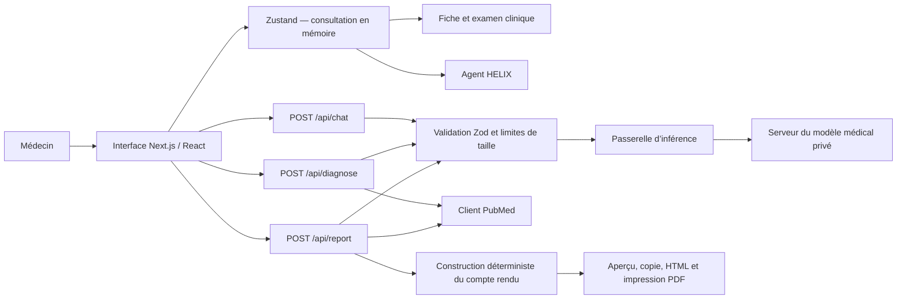
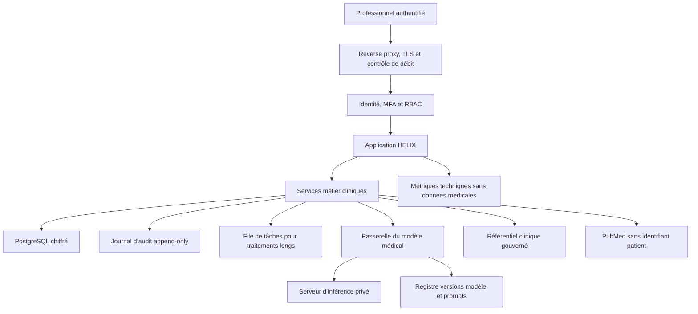

# Brain Health — HELIX

HELIX est une application d’assistance à la consultation médicale. Elle structure la fiche patient, calcule des alertes déterministes sur les constantes, propose une orientation diagnostique assistée, interroge PubMed et génère un compte rendu médical professionnel soumis à validation humaine.

> Statut : prototype renforcé, adapté aux démonstrations et aux travaux de validation. Il n’est pas encore autorisable pour un usage médical de production. Les blockers sont détaillés dans la section [Production readiness](#production-readiness).

## Fonctions disponibles

- Fiche patient structurée : identité, motif, histoire de la maladie, antécédents, allergies, traitements, mode de vie, constantes et examen par appareil.
- Alertes locales sur certaines constantes avec seuils explicites.
- Orientation diagnostique structurée : hypothèses, probabilité, arguments, diagnostics différentiels et code CIM-10.
- Chat médical capable d’extraire des informations vers la fiche.
- Recherche bibliographique PubMed sans transmission de l’identité du patient.
- Compte rendu A4 structuré, copiable, téléchargeable et imprimable.
- Repli déterministe du compte rendu si le moteur d’inférence est indisponible.
- Passerelle générique pour connecter le futur modèle HELIX finetuné.

## Stack technique

| Couche | Technologie | Rôle |
|---|---|---|
| Runtime | Node.js 24 cible | Exécution serveur |
| Framework | Next.js 16.3, App Router | Interface et routes HTTP |
| UI | React 19.2, TypeScript 6 | Composants et typage strict |
| Design | Tailwind CSS 3.4, Framer Motion, Lucide | Mise en page et interactions |
| État client | Zustand 5 | Consultation en mémoire |
| Validation | Zod 4 | Contrats d’entrée et sorties structurées |
| Inférence | Endpoint privé compatible `/v1/chat/completions` | Modèle médical actuel ou futur modèle finetuné |
| Références | NCBI PubMed E-utilities | Recherche bibliographique |
| Tests | Vitest 3.2 | Tests unitaires du domaine et de la passerelle |
| Packaging | Docker multi-stage | Exécution autonome avec utilisateur non privilégié |

Les versions directes sont verrouillées dans `package.json` et `package-lock.json`. `npm audit` ne remonte actuellement aucune vulnérabilité connue.

## Architecture actuelle



### Principes appliqués

1. **Le domaine ne dépend pas du fournisseur du modèle.** Les routes appellent `generateMedicalText()` et ne connaissent ni SDK ni infrastructure d’inférence.
2. **Les entrées sont non fiables.** Chaque route limite la taille du corps et valide le JSON avec Zod.
3. **La sortie du modèle est non fiable.** Les sorties diagnostiques et narratives sont revalidées avant utilisation.
4. **Le compte rendu garde un noyau déterministe.** Le modèle ne peut reformuler que l’histoire, la synthèse et la conclusion. Il ne peut pas ajouter une prescription, un examen ou une conduite à tenir dans cette route.
5. **Les réponses médicales ne sont pas mises en cache.** Les routes renvoient `Cache-Control: no-store, private`.
6. **Les requêtes diagnostiques obsolètes sont annulées.** Une modification plus récente de la fiche interrompt l’analyse précédente.
7. **Les erreurs techniques ne révèlent ni prompt ni données patient.** Elles sont normalisées par la passerelle.

## Organisation du dépôt

```text
app/
  api/
    chat/                 extraction conversationnelle et ordonnance suggérée
    diagnose/             orientation diagnostique et références PubMed
    health/               endpoint de vie du service
    report/               construction et enrichissement du compte rendu
  page.tsx                composition de l’écran de consultation
components/
  agent/                  agent, hypothèses, alertes et repérage corporel
  consultation/           fiche, progression et compte rendu
  ui/                     composants visuels élémentaires
config/
  practice.ts             identité publique du médecin et de l’établissement
lib/
  ai/model-gateway.ts     contrat unique vers le moteur d’inférence
  references/pubmed.ts    accès PubMed centralisé
  api-validation.ts       schémas Zod des routes
  http.ts                 lecture bornée et réponses sans cache
  skills.ts               routage des domaines cliniques actifs
  utils.ts                alertes et progression déterministes
skills/                   catalogue clinique expérimental versionné
store/                    état de consultation en mémoire
tests/                    tests unitaires
types/                    contrats TypeScript du domaine
```

## Flux applicatifs

### Orientation diagnostique

1. La fiche est modifiée dans le navigateur.
2. Après 1,5 seconde sans nouvelle saisie, l’analyse précédente est annulée.
3. Le navigateur appelle `POST /api/diagnose`.
4. Le serveur retire le nom, le prénom, la profession et la date avant l’inférence.
5. Le moteur retourne un JSON d’hypothèses et de suggestions.
6. Zod rejette tout format inattendu.
7. Les termes diagnostiques servent à rechercher trois références PubMed maximum.
8. Le résultat validé remplace l’état précédent dans Zustand.

### Chat et extraction de fiche

1. Le médecin envoie une instruction ou une dictée.
2. Les dix derniers messages maximum et la fiche clinique sans identité nominative sont envoyés au moteur.
3. La réponse doit contenir `reponse`, `type` et éventuellement `ficheUpdate`.
4. `ficheUpdate` est validé avant fusion profonde avec la fiche existante.
5. Une mise à jour clinique déclenche une nouvelle analyse diagnostique.

### Compte rendu

1. Le serveur construit toutes les rubriques à partir de la fiche, des hypothèses, des alertes et des décisions proposées.
2. Ce document structuré est déjà utilisable sans modèle.
3. Si le moteur répond, seuls trois champs narratifs sont reformulés.
4. Les examens et prises en charge restent ceux déjà présents dans la consultation.
5. Le médecin vérifie puis copie, télécharge ou imprime le document.

## Intégration du modèle HELIX finetuné

La passerelle attend un endpoint HTTP privé compatible avec le contrat suivant.

### Requête

```json
{
  "model": "helix-medical",
  "messages": [
    { "role": "system", "content": "Instructions système" },
    { "role": "user", "content": "Données cliniques structurées" }
  ],
  "max_tokens": 2048,
  "temperature": 0.1
}
```

### Réponse minimale

```json
{
  "choices": [
    {
      "message": {
        "content": "{\"hypotheses\":[],\"suggestions\":[]}"
      }
    }
  ]
}
```

La passerelle applique un timeout, une tentative supplémentaire sur erreur transitoire, une authentification Bearer facultative et des erreurs normalisées.

### Variables d’environnement

```bash
cp .env.example .env.local
```

| Variable | Obligatoire | Description |
|---|---:|---|
| `MEDICAL_MODEL_ENDPOINT` | Oui en exploitation | URL complète du endpoint de chat |
| `MEDICAL_MODEL_NAME` | Oui | Identifiant/version du modèle chargé |
| `MEDICAL_MODEL_API_KEY` | Selon le réseau | Secret de la passerelle interne |
| `MEDICAL_MODEL_TIMEOUT_MS` | Non | Timeout, 45 secondes par défaut |
| `MEDICAL_MODEL_MAX_RETRIES` | Non | Nombre de nouvelles tentatives |
| `NEXT_PUBLIC_PRACTITIONER_*` | Oui avant signature | Identité du médecin |
| `NEXT_PUBLIC_FACILITY_*` | Oui avant signature | Identité de l’établissement |

Les variables préfixées `NEXT_PUBLIC_` sont visibles dans le navigateur et ne doivent contenir aucun secret.

### Exigences avant branchement du modèle finetuné

- Dataset dé-identifié, traçable, documenté et approuvé par la gouvernance médicale.
- Séparation stricte entre jeux d’entraînement, validation et test.
- Jeu d’évaluation clinique figé par spécialité et niveau d’urgence.
- Mesure de la sensibilité des red flags, du taux d’hallucination, des omissions, de l’abstention et de la conformité JSON.
- Évaluation spécifique des allergies, contre-indications, grossesse, pédiatrie et insuffisances rénale/hépatique.
- Version immuable du modèle, du tokenizer, des prompts et des règles cliniques pour chaque résultat.
- Mode observation avant activation, puis déploiement progressif et retour arrière immédiat.
- Interdiction d’apprentissage automatique sur les consultations réelles sans procédure explicite d’autorisation et de dé-identification.
- Validation humaine obligatoire : le modèle ne signe jamais un diagnostic ou une prescription.

## Installation et exécution

Prérequis : Node.js 22 ou 24 et npm 10+.

```bash
npm ci
cp .env.example .env.local
npm run dev
```

Application : `http://localhost:3000`

Vérification du service : `GET /api/health`

### Vérifications locales

```bash
npm run typecheck
npm test
npm run build
npm audit
```

La commande complète est :

```bash
npm run check
```

### Exécution conteneurisée

```bash
docker build -t brain-health .
docker run --rm -p 3000:3000 --env-file .env.local brain-health
```

L’image finale utilise l’artefact Next.js standalone et un utilisateur non privilégié.

## API

| Méthode | Route | Usage | Repli |
|---|---|---|---|
| `GET` | `/api/health` | Vie du service | Sans dépendance au modèle |
| `POST` | `/api/chat` | Chat et extraction structurée | Erreur normalisée si moteur indisponible |
| `POST` | `/api/diagnose` | Hypothèses et PubMed | Erreur normalisée si moteur indisponible |
| `POST` | `/api/report` | Compte rendu | Document déterministe complet |

La taille d’une requête médicale est limitée à 128 Kio. Les schémas complets sont définis dans `lib/api-validation.ts`.

## Protection des données

État actuel :

- La consultation réside uniquement dans la mémoire du navigateur.
- Il n’existe pas encore de base patient, de compte utilisateur ou de sauvegarde.
- Le nom et le prénom ne sont pas transmis au moteur pour le chat et le diagnostic.
- L’identité patient est utilisée localement pour le document final mais n’entre pas dans l’enrichissement narratif du rapport.
- PubMed reçoit uniquement des termes diagnostiques et filtres bibliographiques.
- Les routes HTTP ne journalisent pas les prompts ni le contenu du dossier.

Exigences de production :

- TLS de bout en bout, chiffrement des données au repos et gestion centralisée des secrets.
- Authentification forte, RBAC, séparation des établissements et principe du moindre privilège.
- Journal d’audit immuable : lecture, modification, export, impression, validation et signature.
- Politique de rétention, suppression, sauvegarde, restauration et continuité d’activité.
- Consentement, information patient, registre de traitements et validation juridique locale.
- Aucun contenu médical brut dans les logs techniques, traces ou métriques.

## Production readiness

### Verdict

**Non, l’application n’est pas encore ready for production médicale.** Le front, les contrats API, le compte rendu et la passerelle d’inférence constituent un bon socle de prototype. Les éléments suivants empêchent cependant une mise en service réelle.

| Domaine | État | Niveau | Action requise |
|---|---|---:|---|
| Build reproductible | Disponible | OK | Maintenir `npm ci` et l’image versionnée |
| Vulnérabilités dépendances | Audit à zéro | OK | Audit continu à chaque livraison |
| Validation des entrées | Zod + limite 128 Kio | OK | Ajouter tests de fuzzing |
| Passerelle modèle | Découplée et testée | OK | Ajouter version et métriques d’inférence |
| Rapport médical | Structuré + repli déterministe | Bon | Ajouter signature et version de document |
| Authentification | Absente | **Blocker** | OIDC interne, MFA et sessions sécurisées |
| Autorisation | Absente | **Blocker** | RBAC médecin, infirmier, admin, auditeur |
| Dossier patient | Mémoire navigateur uniquement | **Blocker** | PostgreSQL chiffré, migrations et sauvegardes |
| Isolation établissements | Absente | **Blocker** | Tenant explicite sur chaque donnée et requête |
| Audit médical | Absent | **Blocker** | Journal append-only et horodatage fiable |
| Signature/validation | Bouton visuel seulement | **Blocker** | Workflow brouillon, validé, signé, amendé |
| Validation clinique du modèle | Non réalisée | **Blocker** | Protocole d’évaluation et comité médical |
| Gouvernance des règles | Fichiers expérimentaux | Élevé | Sources, propriétaire, date et version clinique |
| Observabilité | Logs techniques minimaux | Élevé | Métriques sans données patient, alertes et traces |
| Résilience | Timeout et une nouvelle tentative | Moyen | Circuit breaker, quotas, test de charge |
| Tests unitaires | 9 tests | Moyen | Étendre domaine, routes, exports et prompts |
| Tests E2E | Absents | Élevé | Parcours consultation, rapport et erreurs |
| Accessibilité | Partielle | Moyen | Audit clavier, lecteur d’écran et contraste |
| Conformité juridique | Non documentée | **Blocker** | Analyse juridique et protection des données |

### Architecture cible



### Ordre de mise en œuvre recommandé

1. Authentification, RBAC, modèle de données patient et journal d’audit.
2. Workflow de validation/signature du compte rendu et gestion des amendements.
3. Gouvernance des règles cliniques et retrait de toute recommandation non sourcée.
4. Banc d’évaluation du modèle finetuné avec critères d’abstention.
5. Observabilité, contrôle de débit, sauvegarde/restauration et tests de charge.
6. Tests E2E, audit de sécurité indépendant et validation juridique.
7. Phase pilote supervisée, analyse des incidents et décision formelle d’ouverture.

## Dette technique restante

- `FichePatient.tsx`, `AgentPanel.tsx`, `BodyMap.tsx` et `ReportModal.tsx` sont encore trop volumineux. Ils devront être divisés par domaine fonctionnel avant l’ajout de plusieurs équipes.
- Le profil du médecin est injecté par variables d’environnement ; en production il devra provenir du compte authentifié.
- Les fichiers `skills/*/SKILL.md` sont un catalogue expérimental. Leur contenu thérapeutique et tarifaire ne doit pas être considéré comme une base clinique validée.
- La progression de consultation est indicative et ne garantit pas la complétude médicale.
- La recherche PubMed est tolérante aux erreurs mais n’est pas un moteur de recommandations thérapeutiques.
- L’export actuel est un HTML imprimable. Un PDF signé et horodaté nécessite un service documentaire dédié.

## Règles de contribution

- Aucun secret dans Git ou dans une variable `NEXT_PUBLIC_*`.
- Aucun log contenant le dossier, le prompt ou la réponse médicale brute.
- Toute nouvelle route doit limiter le corps, valider avec Zod et désactiver le cache.
- Toute sortie du modèle doit être revalidée et avoir un repli explicite.
- Toute règle médicale doit avoir un propriétaire clinique, une source, une date de revue et une version.
- Une modification du modèle, du prompt ou d’un seuil clinique exige des tests de non-régression.
